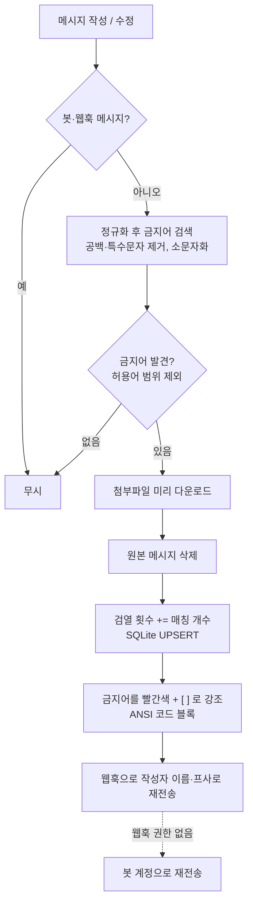

# 🚫 Discord Censor Bot

부적절한 단어가 포함된 메시지를 자동으로 삭제한 뒤, **어떤 단어가 문제였는지 강조해서** 다시 보여주는 디스코드 검열 봇입니다.
안 쓰는 안드로이드 휴대폰에 **Termux**를 설치해 24시간 호스팅하는 것을 목표로 만들었습니다.

## ✨ 주요 기능

| 기능 | 설명 |
| --- | --- |
| **메시지 삭제** | 금지어가 포함된 메시지를 즉시 삭제합니다. 메시지를 **수정**해서 금지어를 넣는 경우도 잡아냅니다. |
| **원문 재전송** | 웹훅을 이용해 **작성자의 닉네임과 프로필 사진 그대로** 메시지를 다시 보여줍니다. 첨부파일도 함께 재업로드합니다. |
| **금지어 강조** | ANSI 코드 블록을 이용해 금지어를 🟥 **빨간색 + `[ ]` 괄호**로 표시합니다. 색상이 보이지 않는 모바일에서도 괄호로 알아볼 수 있습니다. |
| **검열 횟수 누적** | 유저별 검열 횟수를 SQLite에 저장합니다. 한 메시지에서 금지어가 3번 나오면 **3회**로 카운트합니다. |
| **우회 표현 감지** | `시 발`, `시.발`, `F u C k`처럼 공백·특수문자를 끼워 넣거나 대소문자를 섞은 표현도 감지합니다. |
| **허용어(예외) 처리** | `시발점`, `다시 발견`처럼 금지어를 포함하지만 정상적인 표현은 검열하지 않습니다. |
| **조회 명령어** | `/검열횟수`, `/검열순위` 슬래시 명령어로 누적 기록을 확인할 수 있습니다. |

> 이 봇은 **검열과 기록만** 담당하며, 타임아웃·추방 등의 제재 기능은 의도적으로 포함하지 않았습니다.

### 재전송 예시

코드 블록 안에서 `[시발]` 부분이 빨간색으로 표시됩니다.

```
아 [시발] 진짜 어렵네
```
<sub>🚫 부적절한 표현 1건이 감지되어 검열되었습니다 · 누적 3회</sub>

## 🔄 동작 흐름



## 🛠 기술 스택

- **Node.js 22.13+** (ESM)
- **discord.js v14**
- **node:sqlite** — Node 내장 SQLite. `better-sqlite3` 같은 네이티브 모듈을 빌드할 필요가 없어 Termux(ARM 안드로이드)에서도 설치가 간단합니다.
- **node:test** — Node 내장 테스트 러너. 외부 의존성은 `discord.js` 하나뿐입니다.

## 📁 프로젝트 구조

```
.
├── src/
│   ├── index.js        # 진입점: 클라이언트 생성, 이벤트 연결, 명령어 등록
│   ├── config.js       # .env 로드 및 설정
│   ├── filter.js       # 금지어 탐지 (정규화 + 원문 인덱스 매핑 + 허용어)
│   ├── formatter.js    # 빨간색 + [ ] 강조 렌더링, 2000자 제한 처리
│   ├── moderator.js    # 삭제 → 카운트 → 웹훅 재전송 흐름
│   ├── storage.js      # SQLite 검열 횟수 저장소
│   ├── commands.js     # /검열횟수, /검열순위
│   └── logger.js
├── data/
│   ├── banned-words.txt   # 금지어 목록
│   └── allowed-words.txt  # 허용어(예외) 목록
├── test/               # 단위 테스트 (디스코드 연결 없이 실행)
├── scripts/start.sh    # Termux 실행 스크립트 (wake lock + 자동 재시작)
└── .env.example
```

## 💡 구현 포인트

### 1. 우회 표현 감지와 원문 위치 복원
단순 `includes()`로는 `시 발`, `시.발` 같은 우회 표현을 잡을 수 없습니다.
그래서 **글자·숫자만 남기고 소문자화한 정규화 문자열**에서 금지어를 찾되, 정규화하면서 각 글자가 원문의 어느 위치에서 왔는지 인덱스 맵을 함께 만들어 둡니다.
매칭 결과를 원문 위치로 되돌리기 때문에 강조 표시는 사용자가 쓴 그대로(`시 발`) 적용됩니다. 이모지 같은 서로게이트 페어 문자가 섞여도 인덱스가 어긋나지 않도록 코드 포인트 단위로 처리했습니다.

### 2. 허용어로 오탐 줄이기
공백을 무시하면 `다시 발견` → `다시발견`처럼 정상 문장에서도 금지어가 만들어집니다.
허용어 목록의 단어가 차지하는 범위를 먼저 구한 뒤, **금지어 매칭이 허용어 범위 안에 완전히 포함되면 무시**합니다. 따라서 `시발점에서 시발`은 뒤의 `시발`만 검열됩니다.

### 3. 긴 금지어 우선 매칭 & 다중 카운트
금지어를 길이 내림차순으로 정렬해 `개새끼`가 `새끼`보다 먼저 매칭되도록 했고, 매칭된 구간은 건너뛰어 같은 글자가 두 번 세어지지 않습니다.
매칭 개수만큼 `INSERT ... ON CONFLICT DO UPDATE SET count = count + ? RETURNING count` 한 번으로 누적합니다.

### 4. 작성자처럼 보이는 재전송
봇이 직접 보내면 누가 쓴 메시지인지 알기 어렵기 때문에, 채널마다 웹훅을 하나 만들어 캐싱하고 **작성자의 서버 닉네임과 아바타**로 메시지를 보냅니다.
- 스레드/포럼 게시글은 상위 채널의 웹훅에 `threadId`를 지정해 보냅니다.
- 재전송 시 `allowedMentions: { parse: [] }`로 원문의 `@everyone`, 유저 멘션이 다시 울리지 않게 합니다.
- 삭제하면 첨부파일 URL이 무효화되므로 **삭제 전에 다운로드**해 두었다가 함께 올립니다.
- 웹훅 권한이 없거나 웹훅이 삭제된 경우 봇 계정으로 `**닉네임** 님의 메시지` 헤더를 붙여 대체 전송합니다.
- 봇이 보낸 재전송 메시지에도 금지어가 들어 있으므로, 봇·웹훅 메시지는 검사 대상에서 제외해 무한 루프를 막습니다.

### 5. 빨간색 + 괄호 강조
디스코드의 `ansi` 코드 블록과 ANSI 이스케이프 코드(`\u001b[1;31m`)로 금지어를 빨간색으로 표시하고, 동시에 `[ ]` 괄호로 감쌉니다.
디스코드 모바일 앱은 ANSI 색상을 표시하지 못하지만 괄호는 그대로 보이기 때문에, **기기와 상관없이 하나의 메시지로** 금지어를 알아볼 수 있습니다.
또한 사용자가 입력한 ` ``` `가 코드 블록을 깨뜨리지 않도록 백틱 뒤에 zero-width space를 넣고, 2000자 제한을 넘으면 ANSI 코드를 뺀 `[ ]` 형식으로 바꾸거나 본문을 잘라냅니다.

## 🚀 시작하기

### 1. 디스코드 봇 만들기

1. [Discord Developer Portal](https://discord.com/developers/applications)에서 **New Application** 생성
2. **Bot** 탭
   - **Reset Token**으로 토큰 발급 → `.env`에 사용 (절대 공개 저장소에 올리지 마세요)
   - **Privileged Gateway Intents**에서 ✅ `MESSAGE CONTENT INTENT`를 켭니다. (메시지 내용 읽기에 필요)
3. **OAuth2 → URL Generator**
   - Scopes: `bot`, `applications.commands`
   - Bot Permissions: `View Channels`, `Send Messages`, `Send Messages in Threads`, `Manage Messages`, `Manage Webhooks`, `Attach Files`, `Read Message History`
   - 생성된 URL로 서버에 초대합니다. 아래 URL의 `CLIENT_ID`만 바꿔서 사용해도 됩니다.

   ```
   https://discord.com/oauth2/authorize?client_id=CLIENT_ID&scope=bot+applications.commands&permissions=275414887424
   ```

> 봇 역할은 검열 대상 유저의 역할보다 **위에** 있어야 하며, 채널별 권한 덮어쓰기로 `메시지 관리`가 막혀 있지 않은지 확인하세요.

### 2. 로컬에서 실행 (Windows)

```bash
git clone https://github.com/<your-id>/discord-censor-bot.git
cd discord-censor-bot
npm install
copy .env.example .env    # PowerShell/CMD. Git Bash 라면 cp
```

`.env` 파일을 열어 `DISCORD_TOKEN`을 채운 뒤 실행합니다. 개발 중에는 `GUILD_ID`에 테스트 서버 ID를 넣으면 슬래시 명령어가 즉시 등록됩니다.

```bash
npm start
```

### 3. Termux에 배포 (안드로이드)

```bash
pkg update && pkg upgrade
pkg install nodejs git tmux termux-api
git clone https://github.com/<your-id>/discord-censor-bot.git
cd discord-censor-bot
npm install
cp .env.example .env && nano .env
```

`tmux` 세션 안에서 실행하면 SSH 연결을 끊어도 봇이 계속 동작합니다.

```bash
tmux new -s censor 'bash scripts/start.sh'
```

- 세션에서 빠져나오기: `Ctrl + B` 후 `D`
- 다시 접속: `tmux attach -t censor`
- `scripts/start.sh`는 `termux-wake-lock`으로 화면이 꺼져도 CPU가 잠들지 않게 하고, 봇이 비정상 종료되면 5초 후 자동으로 재시작합니다.

코드 업데이트 시:

```bash
tmux kill-session -t censor
git pull && npm install
tmux new -s censor 'bash scripts/start.sh'
```

#### 안정적인 상시 구동을 위한 팁
- 안드로이드 설정에서 **Termux의 배터리 최적화를 해제**하세요.
- 안드로이드 12 이상은 백그라운드 프로세스를 강제 종료하는 *Phantom Process Killer*가 있습니다. 봇이 자주 꺼진다면 개발자 옵션의 **"하위 프로세스 제한 사용 중지"** 를 켜거나 ADB로 비활성화하세요.
- Termux는 F-Droid 또는 GitHub 릴리스 버전 사용을 권장합니다. (Play 스토어 버전은 업데이트가 중단됨)

## 💬 명령어

| 명령어 | 설명 |
| --- | --- |
| `/검열횟수 [유저]` | 유저(생략 시 본인)의 누적 검열 횟수와 서버 내 순위를 보여줍니다. |
| `/검열순위` | 서버에서 검열 횟수가 많은 상위 10명을 보여줍니다. |

검열 횟수는 **서버별로 따로** 집계됩니다.

## 📝 금지어 관리

`data/banned-words.txt`와 `data/allowed-words.txt`에 한 줄에 하나씩 작성하고 봇을 재시작하면 반영됩니다.

```text
# banned-words.txt
시발
fuck
```

```text
# allowed-words.txt — 금지어를 포함하지만 허용할 표현
시발점
다시발      ← "다시 발견", "다시 발표" 등 띄어쓰기로 생기는 오탐 방지
```

- 대소문자, 공백, 특수문자는 무시하고 비교하므로 금지어는 기본형 하나만 적으면 됩니다.
- 오탐이 발생하면 해당 표현을 허용어에 추가하세요.

## 🧪 테스트

디스코드에 연결하지 않고 탐지·렌더링·저장 로직을 검증합니다.

```bash
npm test
```

## ⚠️ 한계

- 공백을 무시하는 방식 특성상 띄어쓰기로 이어진 정상 문장이 오탐될 수 있으며, 허용어 목록으로 보완합니다.
- `ㅅ1ㅂ`처럼 숫자·유사 문자로 바꾼 표현이나 초성/자모 분리(`ㅅㅣㅂㅏㄹ`)는 금지어 목록에 따로 추가해야 감지됩니다.
- 디스코드 모바일 앱에서는 빨간색이 표시되지 않고 `[ ]` 괄호로만 강조됩니다.
- 봇이 꺼져 있는 동안 작성·수정된 메시지는 검열되지 않습니다.
